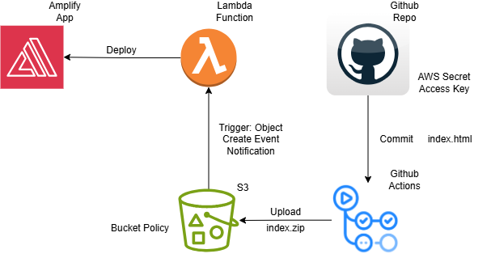

# CI/CD Demo: Sync HTML File to S3 Bucket as ZIP using GitHub Actions

## Table of Contents

- [Overview](#overview)
- [Prerequisites](#prerequisites)
- [Steps to Set Up CI/CD with GitHub Actions](#steps-to-set-up-cicd-with-github-actions)
    - [Step 1: Store AWS Credentials in GitHub Secrets](#step-1-store-aws-credentials-in-github-secrets)
    - [Step 2: Create a GitHub Actions Workflow](#step-2-create-a-github-actions-workflow)
    - [Step 3: GitHub Actions Workflow (.github/workflows/ci-cd.yml)](#step-3-github-actions-workflow-githubworkflowsci-cdyml)
    - [Step 4: Push Changes and Trigger the Workflow](#step-4-push-changes-and-trigger-the-workflow)
    - [Step 5: Verify the Deployment](#step-5-verify-the-deployment)
- [Example Folder Structure](#example-folder-structure)
- [Common Questions](#common-questions)

## Overview

In this demonstration, we will showcase how to set up a **Continuous Integration (CI) and Continuous Deployment (CD)** pipeline using **GitHub Actions** to automatically deploy a simple HTML file from a GitHub repository into an **Amazon S3 bucket** as a **ZIP file**. The demo will cover:

- Setting up GitHub Actions for CI/CD.
- Syncing a simple HTML file from GitHub to a private S3 bucket.
- Using AWS CLI in the GitHub Actions workflow to interact with S3.

**Diagram of this demo**
  


## Prerequisites

Before you start, ensure you have the following:

1. **GitHub Repository**: A repository containing your HTML file (e.g., index.html).
2. **Amazon S3 Bucket**: A private S3 bucket where you want to deploy the file.
3. **AWS Credentials**: Access to AWS through access keys (AWS_ACCESS_KEY_ID and AWS_SECRET_ACCESS_KEY).
4. **GitHub Secrets**: Store your AWS credentials in GitHub Secrets for secure access during the workflow.

## Steps to Set Up CI/CD with GitHub Actions

### Step 1: Store AWS Credentials in GitHub Secrets

1. Go to your **GitHub repository**.
2. Navigate to **Settings** > **Secrets and variables** > **Actions** > **New repository secret**.
3. Add the following secrets:
   - AWS_S3_BUCKET_NAME: Your AWS S3 bucket name.
   - AWS_ACCESS_KEY_ID: Your AWS Access Key ID.
   - AWS_SECRET_ACCESS_KEY: Your AWS Secret Access Key.

### Step 2: Create a GitHub Actions Workflow

Now, let's set up a GitHub Actions workflow that will automatically deploy your HTML file to the S3 bucket whenever there is a push to the main branch.

1. In your repository, create the directory `.github/workflows/` if it doesn't already exist.
2. Inside `.github/workflows/`, create a new YAML file, e.g., `ci-cd.yml`.

### Step 3: GitHub Actions Workflow (.github/workflows/ci-cd.yml)

```yaml
name: CI/CD: Sync HTML to S3

on:
  push:
    branches:
      - main # Trigger the workflow on push to the main branch

jobs:
  deploy:
    runs-on: ubuntu-latest
    steps:
      # Step 1: Checkout the repository
      - name: Checkout code
        uses: actions/checkout@v2

      # Step 2: Set up AWS CLI
      - name: Set up AWS CLI
        uses: aws-actions/configure-aws-credentials@v1
        with:
          aws-access-key-id: ${{ secrets.AWS_ACCESS_KEY_ID }}
          aws-secret-access-key: ${{ secrets.AWS_SECRET_ACCESS_KEY }}
          aws-region: us-east-1 # Change to your preferred region

      # Step 3: Install zip utility
      - name: Install zip
        run: sudo apt-get install zip

      # Step 4: Zip the HTML file
      - name: Zip the HTML file
        run: zip -r html-file.zip index.html

      # Step 5: Sync the zipped file to the S3 bucket
      - name: Deploy to S3
        run: |
          aws s3 cp html-file.zip s3://your-s3-bucket/path/
```

### Step 4: Push Changes and Trigger the Workflow
If you are using VS Code with Github, you can make the commit and sync using the visual interface. 

If you are using command line:
1. **Commit and Push** your changes (including the GitHub Actions workflow) to the main branch:
2. `git add .github/workflows/ci-cd.yml`
3. `git commit -m "Add CI/CD workflow to deploy HTML to S3"`
4. `git push origin main`
5. Once you push the changes, the workflow will be triggered automatically.

### Step 5: Verify the Deployment

After the workflow completes successfully, verify that the file has been uploaded to your S3 bucket:

1. Go to your **S3 bucket** in the AWS Management Console.
2. Check that the `html-file.zip` is in the bucket.

## Example Folder Structure:

```
my-repo/
├── .github/
│   └── workflows/
│       └── ci-cd.yml
└── index.html
```

## Common Questions

### Q1: Is the AWS Access Key Secure in This Procedure?

Yes, the AWS access key is stored securely using **GitHub Secrets**. Secrets are encrypted and only accessible during the workflow runtime. They are not exposed in the code or logs.

### Q2: Is the Deployment Procedure OS-Independent?

Yes, the procedure is OS-independent. The GitHub Actions runners (Ubuntu, Windows, macOS) are abstracted away, so the workflow will run consistently regardless of your operating system.

### Q3: How do I ensure my AWS access keys are secure?

Store your AWS access keys in **GitHub Secrets**. Additionally, follow best practices such as enabling MFA on your AWS account and granting the **least privilege** permissions to the IAM user.

### Q4: How do I handle errors or failures in the workflow?

Check workflow logs to identify issues. You can also set up **notifications** (e.g., Slack or email) to alert you when a workflow fails.

### Q5: Can I deploy to multiple environments (e.g., staging, production)?

Yes, you can modify the workflow to deploy to different environments by using separate jobs or conditionals based on branches.

```yaml
jobs:
  staging:
    runs-on: ubuntu-latest
    steps:
      - name: Deploy to Staging S3
        run: aws s3 cp html-file.zip s3://your-staging-bucket --acl private --region us-east-1

  production:
    runs-on: ubuntu-latest
    needs: staging # Ensure staging job succeeds before production
    steps:
      - name: Deploy to Production S3
        run: aws s3 cp html-file.zip s3://your-production-bucket --acl private --region us-east-1
```

### Q6: Can I use different AWS accounts or buckets for different branches?

Yes, you can define different secrets for different branches or environments to deploy to separate AWS accounts or buckets.

```yaml
aws-access-key-id: ${{ secrets.STAGING_AWS_ACCESS_KEY_ID }}
aws-secret-access-key: ${{ secrets.STAGING_AWS_SECRET_ACCESS_KEY }}
```

Or for production:

```yaml
aws-access-key-id: ${{ secrets.PROD_AWS_ACCESS_KEY_ID }}
aws-secret-access-key: ${{ secrets.PROD_AWS_SECRET_ACCESS_KEY }}
```
